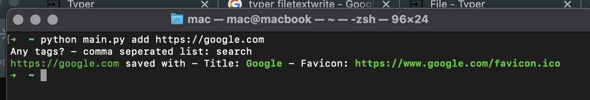
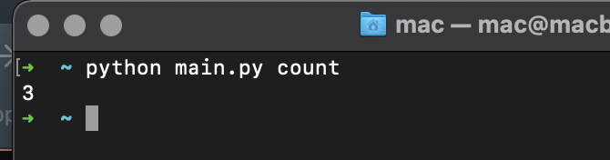
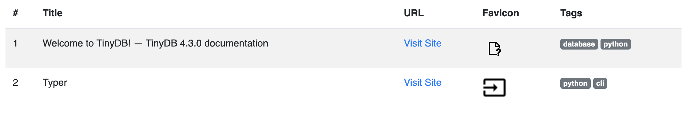
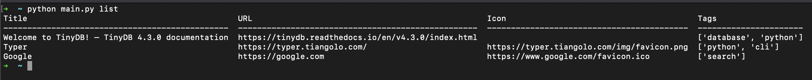

# CLI-Bookmarks
Built using [Typer](https://typer.tiangolo.com/), this script allows you to save, search for, and open urls in the default app. As an added bonus it will also generate and export an HTML file with all the entries.

**NOTE** This app is still under development. The basic functionality works, however. 

### Commands

```shell
Commands:
  add        Create an entry given a URL
  count      Returns the number of entries
  dashboard  Open a webpage with the entries presented
  find       Search for an entry by title given a search term.
  list       Lists all entries
  tags       Provide a single word search term and all entries with tags...
  text       Given a string, fuzzy search the entries and return the top...
```

### Examples

Running `python main.py add https://google.com` produces the output shown. Notice that after providing the URL it'll ask if you want provide any tags? If "no," just press enter and "None" will saved. 



Running with the `count` argument produces



Running with the `dashboard` argument creates an HTML file that looks like this when opened. You'll see that the site's favicon is shown if it was able to be discovered at the time the entry was made. 



Running with the `list` produces the output shown, thanks to [Tabulate](https://pypi.org/project/tabulate/)


